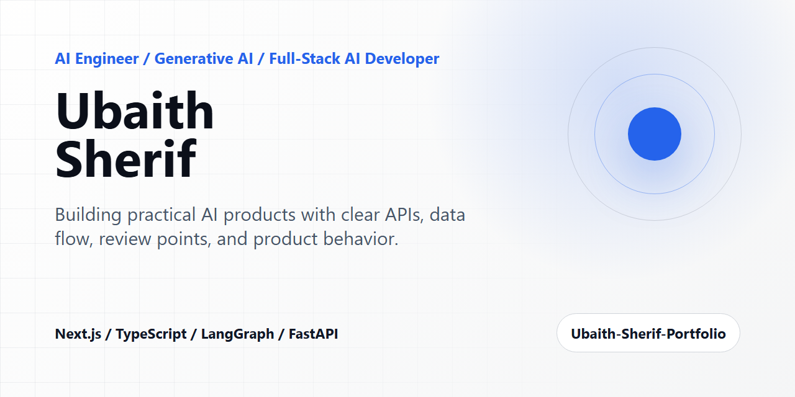
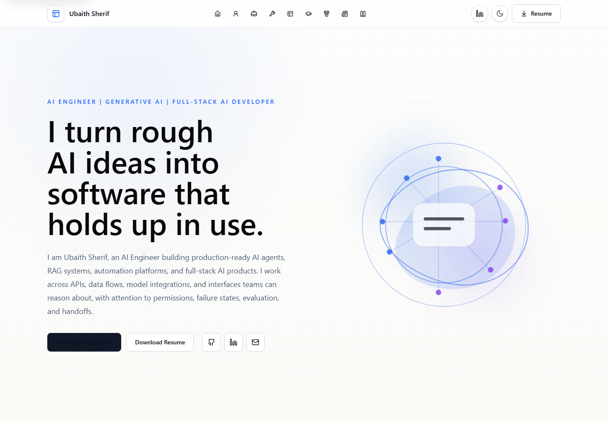
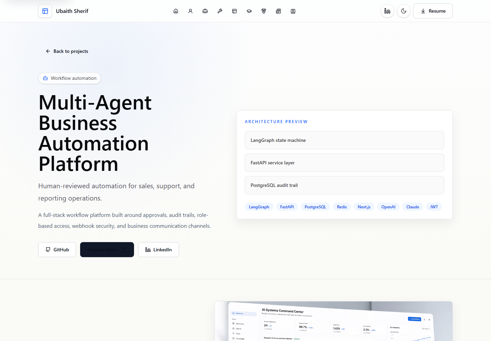
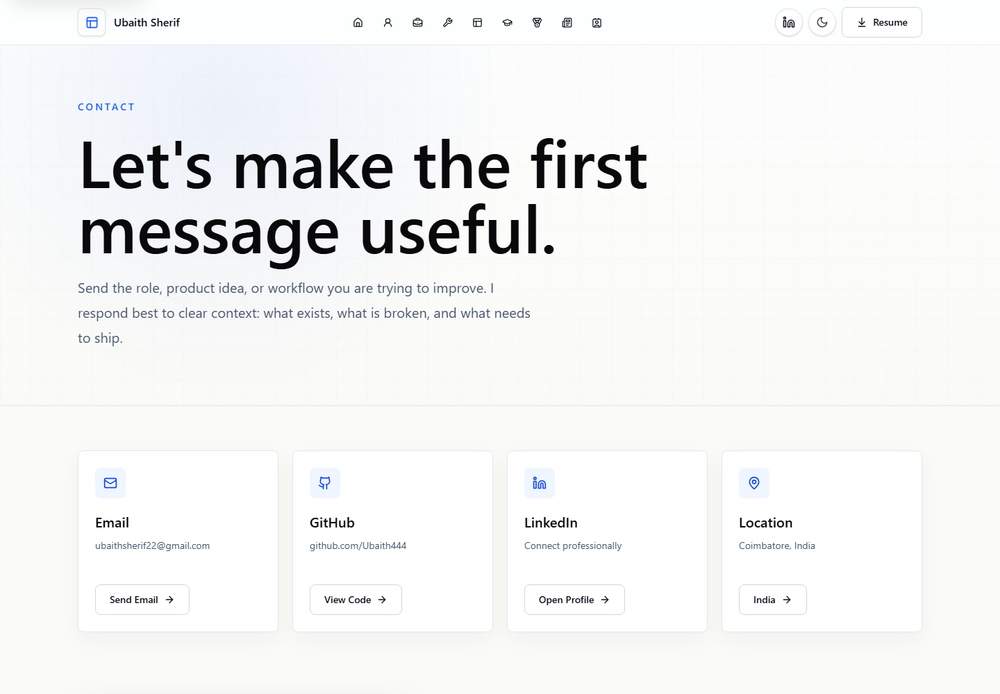

# Ubaith Sherif Portfolio



[](https://nextjs.org/)
[](https://react.dev/)
[](https://www.typescriptlang.org/)
[](https://tailwindcss.com/)
[](LICENSE)
[](https://github.com/ubaith444/Ubaith-Sherif-Portfolio/stargazers)
[](https://github.com/ubaith444/Ubaith-Sherif-Portfolio/actions/workflows/ci.yml)
[](https://vercel.com/)

Production-grade AI Engineer portfolio for Ubaith Sherif. The site presents flagship AI engineering work, project case studies, technical writing, credentials, and recruiter-focused answers with strong SEO, GEO, AEO, accessibility, and deployment readiness.

## Portfolio Preview

| Home | Project Case Study | Contact |
| --- | --- | --- |
|  |  |  |

## About

Ubaith Sherif is an AI Engineer focused on applied LLM products, agent workflows, RAG systems, backend APIs, and full-stack AI interfaces. This portfolio is built to answer recruiter and AI-search queries clearly while showing practical engineering judgment through project architecture, constraints, and proof of work.

## Features

- Editorial homepage with clear AI Engineer positioning.
- Flagship project case studies for AI agents, football intelligence, analytics agents, and classroom AI.
- Technical article pages with article metadata and structured schema.
- Skills section aligned with navigation.
- Certificates rendered as accessible cards.
- Contact page with recruiter-friendly calls to action.
- SEO, GEO, AEO, JSON-LD, sitemap, robots, Open Graph, and Twitter card support.
- Light and dark themes with accessible contrast.
- Production smoke tests and Playwright E2E coverage.

## Tech Stack

- Next.js 15 App Router
- React 19
- TypeScript
- Tailwind CSS 4
- Lucide React
- MDX-ready content pipeline
- Vercel Analytics
- Playwright
- GitHub Actions

## Folder Structure

```text
app/                    Next.js App Router pages, metadata, sitemap, robots
components/             Shared UI, layout, JSON-LD, motion, contact, visuals
content/                Content source files
docs/                   Architecture, deployment, audit, release docs
lib/                    Profile, projects, blog, certifications, utilities
public/                 Resume, visuals, screenshots, social preview assets
scripts/                Smoke test and preview server helpers
tests/                  Playwright production E2E tests
.github/                CI, issue templates, PR template, Dependabot
```

## Installation

```bash
npm ci
```

For local development:

```bash
npm run dev
```

Open `http://localhost:3000`.

## Environment Variables

Create `.env.local` from `.env.example`.

```bash
NEXT_PUBLIC_SITE_URL=https://ubaith-sherif-portfolio.vercel.app
NEXT_PUBLIC_GA_ID=
GITHUB_TOKEN=
```

`NEXT_PUBLIC_SITE_URL` is required for production canonical URLs, sitemap entries, Open Graph URLs, and JSON-LD IDs.

`GITHUB_TOKEN` is optional and only used server-side for higher GitHub API rate limits.

## Development

```bash
npm run dev
npm run lint
npm run typecheck
```

## Build

```bash
npm run build
npm run start -- -p 3002
```

## Testing

```bash
npm run test:smoke
npm run test:e2e
```

The Playwright config starts a production preview with a cross-platform launcher, so it works on Windows and GitHub Actions.

## Deployment

Vercel is the primary deployment target.

```bash
npm run build
vercel
vercel --prod
```

Secondary deployment notes for Netlify and Cloudflare Pages are documented in [docs/deployment.md](docs/deployment.md).

## Lighthouse Scores

Latest local production audit:

| Mode | Performance | Accessibility | Best Practices | SEO | Agentic Browsing |
| --- | ---: | ---: | ---: | ---: | ---: |
| Desktop | 100 | 100 | 100 | 100 | 100 |
| Mobile | 89 | 100 | 100 | 100 | 100 |

Full audit details: [docs/production-readiness-audit.md](docs/production-readiness-audit.md)

## SEO Features

- Route-level metadata and title templates.
- Canonical URLs.
- Sitemap and robots routes.
- Open Graph and Twitter card metadata.
- Semantic headings and landmarks.
- Accessible image alt text and icon labels.

## GEO Features

- Clear professional summary.
- Structured project descriptions.
- Technology stack summaries.
- Case study sections.
- Best-fit roles and proof-of-work sections.
- Factual, recruiter-readable language.

## AEO Features

- FAQ content for common recruiter questions.
- Direct answers for who Ubaith Sherif is, what he builds, his AI stack, and how to contact him.
- Project-level FAQ schema and related project links.
- JSON-LD schemas for Person, WebSite, ProfilePage, FAQPage, SoftwareSourceCode, Article, BreadcrumbList, and ContactPage.

## Accessibility

- Keyboard-reachable skip link.
- Accessible labels for icon-only controls.
- Strong light/dark theme contrast.
- Responsive layout tested from 320 px to 1920 px.
- Playwright coverage for navigation, theme toggle, routes, schemas, and overflow.

## Performance

- Static generation for portfolio routes.
- Server-rendered navigation and CSS-based motion.
- Optimized image usage through Next.js.
- Minimal client JavaScript.
- Security headers configured in `next.config.ts`.

## Future Improvements

- Add unique real screenshots for every project page.
- Add deployed-domain Lighthouse and Core Web Vitals snapshots.
- Add optional newsletter/RSS for technical articles.
- Add signed release artifacts for future versions.

## Contact

- Email: [ubaithsherif22@gmail.com](mailto:ubaithsherif22@gmail.com)
- GitHub: [github.com/Ubaith444](https://github.com/Ubaith444)
- LinkedIn: [linkedin.com/in/ubaith-sherif-4235a5256](https://www.linkedin.com/in/ubaith-sherif-4235a5256/)

## License

This project is licensed under the [MIT License](LICENSE).
